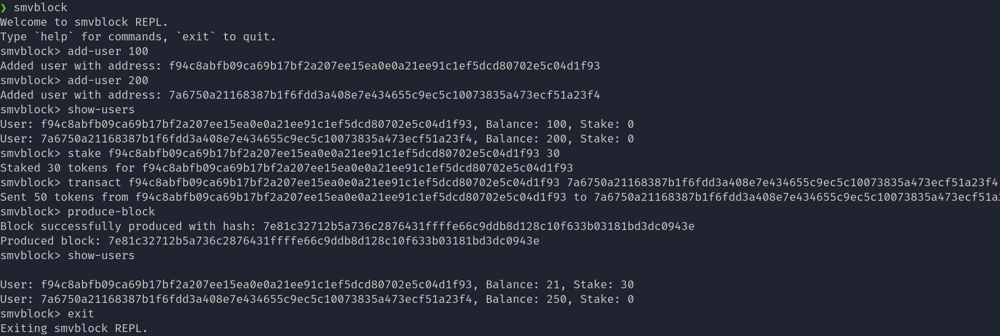

# smvblock
A lightweight distributed system running a minimal blockchain, inspired by
Ethereum’s design principles.



**smvblock** is a work-in-progress (WIP) experiment to build a super simple
blockchain-based distributed system. It aims to capture the essence of
Ethereum's architecture—accounts, blocks, messages, and state transitions—but
without the heavy complexity of the full protocol.

## Goals
- Build a minimal blockchain VM with support for transactions, accounts, and blocks.
- Use a distributed p2p model to propagate blocks and messages.

## Planned architecture
- Node: Maintains local blockchain state and participates in the network.
- Block: A simple container of transactions with references to previous blocks.
- Transaction: Simple account-to-account state transition.
- Database: Abstraction over the nitty-gritty details of the schema for a network.
- P2P Layer: Gossip-style or minimalistic protocol for syncing blocks and transactions.

## Setup
```sh
# this is for the DB
mkdir ~/.smvblock
# setup the system
git clone https://github.com/yourname/smvblock.git
cd smvblock
cargo run
```

## Roadmap (to be extended as I progress)
[-] Block structure
[-] Transaction and payload format
[-] Local chain with basic state validation + PoS
[-] State persistence with SQLite
[ ] Simple CLI node
[ ] Persistence across ultiple nodes
[ ] VM/contract DSL

